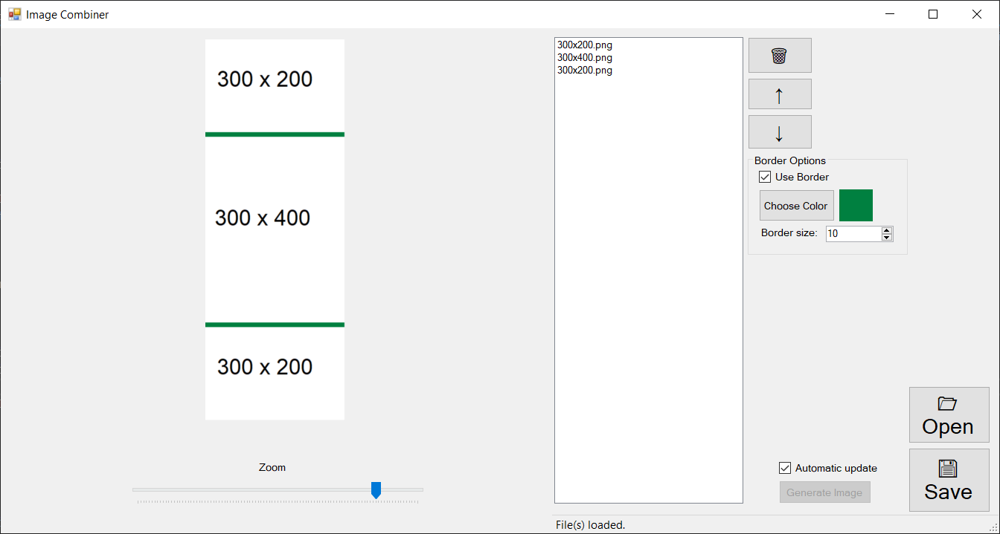

# ImageCombiner

ImageCombiner is a simple tool to combine multiple images into a single larger one. 
Written in C# using WinForms.

## Usage

1. Add one or more images using the "Open" button. 
2. Put them in the order using the ↑ and ↓ buttons.
3. (Optional) Use the options in the border box to add a border between the images.
4. Press "Generate Image" to generate and preview the image.
5. Press "Save" to save the final image.

## Screenshots

## TO-DO

* Fix border size for when there are multiple images with different sizes. Right now, the border is applied to each pair of images, causing it to be the wrong width if the images are different sizes.
* Add progress bars for image generation and move it to a separate thread.
* Fix memory issues (large images fill memory up really fast)
* Better image preview (zooming, etc.)
* More error handling

## Misc.

The preview box is an [ImagePanel component](https://www.codeproject.com/Articles/26532/A-Zoomable-and-Scrollable-PictureBox), thanks to YLS CS. That is subject to the [Code Project Open License (CPOL)](https://www.codeproject.com/info/cpol10.aspx).
